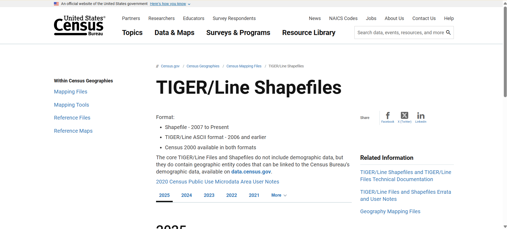

# COVID-19 Vaccination & Socioeconomic Factors Analysis: U.S. County-Level Study

## Project Overview
The project focuses on the relationship between COVID-19 vaccination rates and socioeconomic factors and COVID-19 case rates in 3,202 counties in the U.S.
The interactive web map is a visualization of spatial patterns that display the geographic disparities and facilitate the use of data-based public health interventions.

The project incorporates multifaceted data cleaning, integration, and spatial visualization with the assistance of QGIS and web mapping tools using national datasets of the CDC, The New York Times, and the U.S. Census Bureau.

---

## Why I Created the Map?
The map was designed to visualize the effect of the COVID-19 vaccination rate and socioeconomic variables on COVID-19 case rate in U.S. counties. Although statistical analyses give numeric relationships, maps show the geography of these patterns, emphasizing clusters of vulnerability, as well as areas with the uptake of vaccination is low and counties with high rates of COVID-19 cases. This spatial approach assists in shaping the strategy of public health, and identifies where specific interventions can be the most effective.

## What Went Well with the Final Project?
The integration of various datasets based on the county FIPS codes was also a successful experience, and it was possible to properly merge COVID-19 case data, vaccination rates, and socioeconomic indicators. The maps were effective at revealing expected regional patterns, including the higher rates of cases in regions with lower rates of vaccine coverage and high rates of poverty. The interactive Leaflet map worked effectively, with functional layer switching, and pop-ups enabling the users to view the details of the counties. The static maps as well became readable and ready to be published once the color schemes and classification methods were adjusted. In general, the project was successful in integrating spatial and statistical analysis to create interpretable and visual outputs.

## What I Would Like to Try Differently on Future Maps?
In future mapping, I would consider applying spatial regression to explain spatial autocorrelation that standard regression can miss. Additionally, I would examine the additional use of more explanatory variables, e.g., access to healthcare or educational levels, to enhance the composite risk index. At the technical level, an experiment with advanced web mapping tools, such as Mapbox GL, or Kepler.gl could help to improve interactivity and performance. Moreover, incorporating a time-series animation would enable visualizing how rates of vaccination and the COVID-19 cases change over time, not just providing a static snapshot.

---

## Data Collection Pipeline

### 1. Primary Data Sources

#### COVID-19 Case Data
- Source: NY Times COVID-19 Data GitHub Repository  
- File: us-counties.csv  
- Variables: County FIPS codes, case counts, dates  
- URL: [https://github.com/nytimes/covid-19-data](https://github.com/nytimes/covid-19-data)
- see image: 

#### Vaccination Data
- Source: CDC COVID-19 Vaccination Data  
- File: COVID-19_Vaccinations_in_the_United_States_County.csv  
- Variables: Vaccination percentages, county FIPS codes  
- Collection: CDC official data portal
- URL: [https://data.cdc.gov/Vaccinations/COVID-19-Vaccinations-in-the-United-States-County/8xkx-amqh](https://data.cdc.gov/Vaccinations/COVID-19-Vaccinations-in-the-United-States-County/8xkx-amqh)
- see image: 

#### Socioeconomic Data
- Source: U.S. Census Bureau American Community Survey (ACS)  
- Dataset: ACS 5-Year Estimates 2023 (DP03)  
- Variables: Population, median income, poverty rates  
- Access: Census API or direct download
- URL: [https://www.census.gov/programs-surveys/acs.html](https://www.census.gov/programs-surveys/acs.html)
- see image: .png)

#### Geographic Data
- Source: U.S. Census TIGER/Line Shapefiles  
- File: tl_2023_us_county.shp  
- Purpose: County boundaries for mapping  
- Variables: FIPS codes, land area (for density calculations)
- URL: [https://www.census.gov/geographies/mapping-files/time-series/geo/tiger-line-file.html](https://www.census.gov/geographies/mapping-files/time-series/geo/tiger-line-file.html)
- see image: 
---

## Data Management and Cleaning Process

### 2.1 COVID-19 Case Data Preparation
- Extracted and aggregated case data by FIPS codes.  
- Filtered relevant time periods for analysis.  
- Managed missing or incomplete county-level data.

### 2.2 Vaccination Data Cleaning
- Merged vaccination data with county-level identifiers.  
- Standardized percentage fields.  
- Removed duplicates and non-county records.

### 2.3 Census Data Processing
- Selected key socioeconomic indicators (population, median income, poverty).  
- Cleaned formatting and variable naming.  
- Matched with FIPS codes for integration.

### 2.4 Geographic Data Preparation
- Clipped TIGER/Line shapefiles to U.S. county boundaries.  
- Reprojected shapefiles for web mapping compatibility.  
- Joined spatial data with attribute datasets.

### 2.5 Master Dataset Integration
- Used FIPS codes as unique identifiers.  
- Conducted inner joins to align all datasets.  
- Generated the final dataset for mapping and analysis.

---

## Statistical Analysis Methodology

### 3.1 Descriptive Statistics
- Summarized COVID-19 case rates and vaccination coverage.
- Calculated central tendencies and distribution patterns.

### 3.2 Correlation Analysis
- Explored linear relationships between vaccination rates and case rates.
- Assessed strength of associations with socioeconomic factors.

### 3.3 Multivariate Regression
- Built regression models to predict case rates based on:
  - Vaccination percentages
  - Poverty rates
  - Median income
  - Population size

### 3.4 Categorical Variable Creation for Mapping
- Binned continuous variables into categorical classes (e.g., low, medium, high vaccination coverage).
- Optimized for meaningful visualization.
---

## Data Preparation in QGIS

### Map Design

*COVID-19 Cases Layer*
- *Layer Type:* Choropleth map
- *Base Data:* U.S. Counties
- *Symbology:* Color gradient based on case numbers
- *Controls:* Zoom, pan, optional fullscreen, Gratitude
- *Projection:* EPSG:4326 (WGS84)


Figure 1: QGIS symbology settings for COVID-19 cases choropleth

*Poverty Rate Layer*
- *Layer Type:* Choropleth map
- *Base Data:* U.S. Counties
- *Symbology:* Color gradient based on poverty percentages
- *Controls:* Zoom, pan, optional fullscreen, Gratitude
- *Projection:* EPSG:4326 (WGS84)


Figure 2: QGIS symbology settings for poverty rate choropleth

*Vaccination Rate Layer*
- *Layer Type:* Choropleth map
- *Base Data:* U.S. Counties
- *Symbology:* Color gradient based on vaccination percentages
- *Controls:* Zoom, pan, optional fullscreen, Gratitude
- *Projection:* EPSG:4326 (WGS84)


Figure 3: QGIS symbology settings for vaccination rate choropleth

## Exporting the Interactive Map

### 1. Use qgis2web


Figure 4: qgis2web plugin interface with export configuration


Figure 5: qgis2web plugin interface with export configuration

### 2. Folder Structure After Export


qgis2web_export_folder/
├── index.html              # Main map file
├── resources/
│   ├── style.css          # Styling file
│   └── ...other CSS files
├── data/
│   ├── layers/
│   │   ├── your_layer_1.js
│   │   ├── your_layer_2.js
│   │   └── ...all your map data as JavaScript files
│   └── ...other data files
├── js/
│   ├── qgis2web.js
│   ├── leaflet.js
│   └── ...other JavaScript libraries
├── css/
│   ├── leaflet.css
│   └── ...other CSS libraries
└── images/                   # Map images, icons, etc.
    └── ...image files


### 3. Test Locally
- Open index.html in your browser.
- Check zoom, popups, and base map.

---

## Publishing with GitHub Pages

### Step 1 — Create a Repository
- Go to [https://github.com](https://github.com)
- Click New Repository
- Give a meaningful name (US-COVID19-Cases-Vaccination2023)
- Check Add README and select MIT License

### Step 2 — Upload Files
- Upload everything from the exported final_webmap folder:
  - index.html
  - data folder
  - resources folder
  - supporting folders

### Step 3 — Enable GitHub Pages
- Go to Settings → Pages
- Source: main branch  
- Folder: / (root)  
- Click Save

You’ll get a live URL:


https://github.com/KIAChy21/US-COVID19-Cases-Vaccination2023/


### Step 4 — Add Collaborator
- Go to Settings → Collaborators
- Add instructor’s username: jfobrycki
- Click Add collaborator

---

## Embedding the Map

You can embed the map in another webpage or LMS using an iframe:

html
<iframe src="https://kiahy21.github.io/US-COVID19-Cases-Vaccination2023/" 
      width="100%" 
      height="600" 
      frameborder="0">
</iframe>
`
---
## Repository Structure


US-COVID19-Cases-Vaccination2023/
├── map.html                      # Main map page
├── index.html                    # Landing/page with iframe
├── fullscreen.html               # Full screen map version
├── README.md                     # Project documentation
├── images/                       # Process documentation screenshots
│   ├── data_source.png
│   ├── qgis_processing.png
│   ├── symbology_settings.png
│   └── final_layout.png
├── data/                         # Map data layers
│   └── layers/
│       ├── counties_layer.js
│       ├── covid_cases_layer.js
│       ├── vaccination_layer.js
│       └── poverty_layer.js
├── css/                          # Stylesheets
│   ├── leaflet.css
│   └── ...
├── js/                           # JavaScript libraries
│   ├── qgis2web.js
│   ├── leaflet.js
│   └── ...
├── legend/                       # Map legend assets
│   └── ...
├── webfonts/                     # Web fonts
│   └── ...
├── .gitattributes
└── LICENSE
---
## License

This project is licensed under the MIT License.
You are free to use, modify, and share with proper credit.

--

## Acknowledgments

* Instructor: John Obrycki [jfobrycki]
* Author: Kamal Ibne Amin Chowdhury [KIAChy21]
* Software: QGIS
* Data: NY Times, CDC, U.S. Census Bureau
* Tools: qgis2web, GitHub Pages

---

## Contact

For questions or collaboration, contact: mail to: kch365@uky.edu

---

This project demonstrates how open data and free GIS software can be used to visualize and communicate complex public health information effectively.

```
